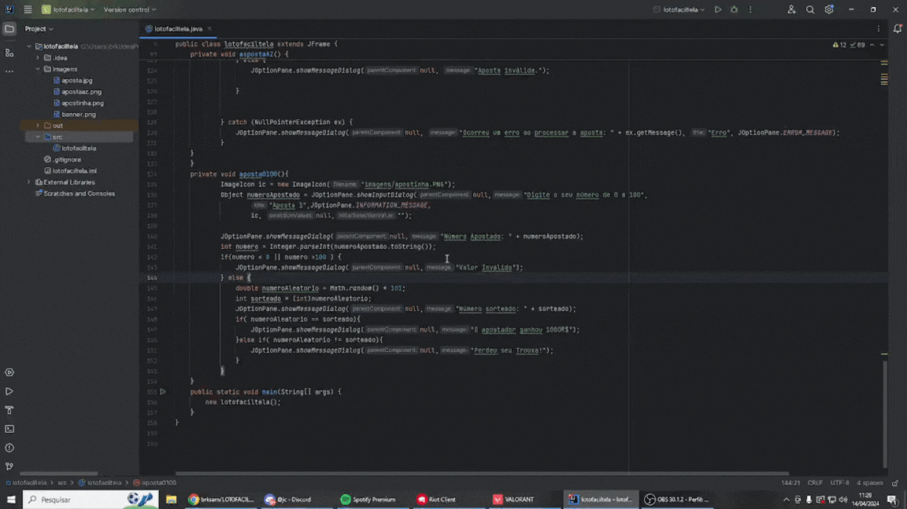

# LOTOFÁCIL-ATIVIDADE-INTERFACE GRÁFICA
ATIVIDADE FACULDADE JAVA.  

-------------------------------------------------------------
# COMO ENTRAR NO CÓDIGO 
Para acessar o trabalho você deve clicar em atividadeLP depois em src logo em seguida verá o codigo fonte da aplicação LOTOFÁCIL.  

-------------------------------------------------------------
# REQUISITOS 
JDK utilizado: 21.  

IDL utilizada IntelliJ.  

Bibliotecas utilizadas: java.io.IOException, java.util.Scanner, java.util.Random.  

-------------------------------------------------------------
# COMO FUNCIONA O PROGRAMA
logo quando iniciar o programa vai olhar o menu onde terá opções de 0 a 3.  

Opção 1: JOGO DE APOSTA ENTRE 0 E 100 (O objetivo é acertar o número que foi gerado aleatoriamente).  

Opção 2: JOGO DE APOSTA ENTRE A E Z ( O obejetivo é acetar a letra que foi gerado aleatoriamente).  

Opção 3: JOGAR ALGUM NÚMERO PAR (O objetivo é colocar algum número par).  

Opção 0: SAIR DO PROGRAMA.

-------------------------------------------------------------
# EXEMPLO DE UM USUÁRIO

# ESSE FOI UM PROJETO SIMPLES. OBRIGADO PELA VISITA!
